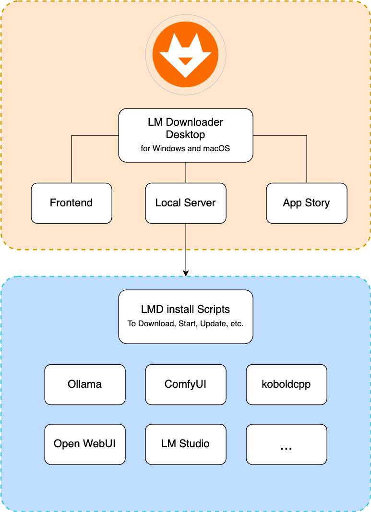

# 魔当桌面客户端 (LM Downloader Desktop)

魔当是一个免费，开源，易上手，且功能强大的AI大模型软件下载工具。

- 对于想在自己电脑上运行大模型的人，欢迎下载使用。
- 如果你是开发者，也欢迎提出意见和贡献代码，完善此工具。
- 如果你开发过大模型应用，可以提交到魔当社区，让更多人能快速下载和使用。

[English](./README.md) · 中文

## 下载

- [下载 最新版魔当](https://gitee.com/lmdown/lm-downloader-desktop/releases)

## 推荐的开发工具

- [VSCode](https://code.visualstudio.com/) + [ESLint](https://marketplace.visualstudio.com/items?itemName=dbaeumer.vscode-eslint)

## 项目运行
本仓库是魔当的本地服务，使用Node.js and TypeScript开发。

### 安装依赖

```bash
$ npm install
```

### 本地运行

```bash
$ npm run dev
```

### 构建

```bash
# 打包生产环境使用的文件
$ npm run build
```

## 完整架构

以下是整个项目的架构图：



## 🔗 链接

- [LM Downloader Desktop](https://gitee.com/lmdown/lm-downloader-desktop)
- [LM Downloader Frontend](https://gitee.com/lmdown/lm-downloader-frontend)
- [LM Downloader Local Server](https://gitee.com/lmdown/lm-downloader-local-server)
- [LM Downloader App Story](https://gitee.com/lmdown/lm-downloader-app-story)
- [LMD Install Scripts](https://gitee.com/lmdown/lm-downloader-app-story)


## 许可证

本项目采用 [Apache License 2.0](http://www.apache.org/licenses/LICENSE-2.0) 进行许可 - 版权 © 2025 lmdown

This project is licensed under the Apache License, Version 2.0 (the "License");
you may not use this file except in compliance with the License.
You may obtain a copy of the License at

    http://www.apache.org/licenses/LICENSE-2.0

Unless required by applicable law or agreed to in writing, software
distributed under the License is distributed on an "as is" basis,
WITHOUT WARRANTIES OR CONDITIONS OF ANY KIND, either express or implied.
See the License for the specific language that governs permissions and
limitations under the License.

# 魔当专业版

魔当专业版具备强大的高级特性，如果您需要使用专业版，或者有定制化需求，请联系我们 <lmdown@163.com>


**专业版特性**：

- 高级数据分析功能。
- 定制化选项。
- 自动化任务处理。
- 远程部署和管理。

除了强大的功能外，我们的专业版还提供全面的客户支持服务：
- 专属客服团队。
- 优先响应服务。
- 技术培训和指导。
- 持续更新和升级。
